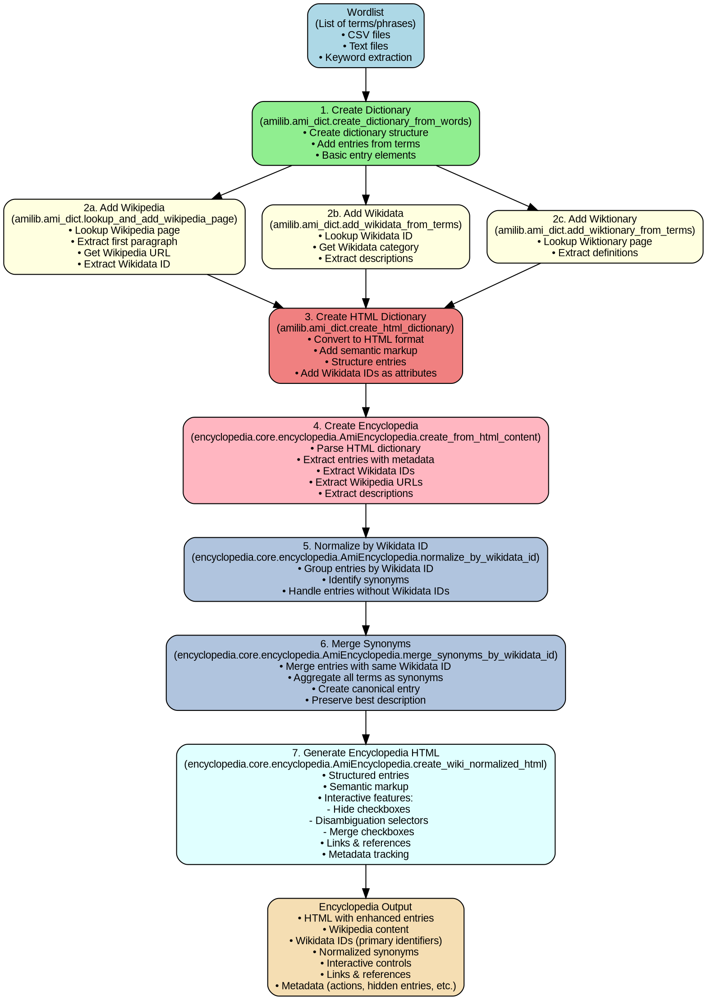

# Encyclopedia Creation from Wordlist - Review for New Members

**Date:** January 9, 2026  
**System Date:** Fri Jan  9 09:21:44 GMT 2026

## Overview

This document reviews how we create an encyclopedia from a wordlist, including the complete pipeline, current capabilities, and answers to key questions about merging, disambiguation, and manual entry management.

## Pipeline: From Wordlist to Encyclopedia

The encyclopedia creation process transforms a simple list of terms/words into a semantically enriched, normalized encyclopedia with Wikipedia, Wikidata, and Wiktionary content.

### Complete Pipeline Flow

The following Graphviz diagram shows the complete pipeline:



### Detailed Stage Descriptions

#### Stage 1: Input - Wordlist
**Input**: A list of terms, words, or phrases from:
- CSV files with extracted keywords
- Text files (one term per line)
- Keyword extraction tools (`Keyword_extraction/`)

**Location**: Input can come from various sources, including keyword extraction in this repository.

#### Stage 2: Create Dictionary
**Process**: Create basic dictionary structure with entry elements for each term.

**Methods** (in `../amilib/amilib/ami_dict.py`):
- `AmiDictionary.create_dictionary_from_words(terms, title, ...)` - Creates dictionary from list of terms
- `AmiDictionary.create_dictionary_from_wordfile(wordfile, ...)` - Creates from text file
- `AmiDictionary.create_dictionary_from_csv(csv_file, ...)` - Creates from CSV

**Output**: XML dictionary with basic entries (term, name attributes only).

#### Stage 3: Enhance Dictionary (Parallel Processes)
Three parallel enhancement processes add semantic content:

**3a. Add Wikipedia** (`lookup_and_add_wikipedia_page()`):
- Looks up Wikipedia page for each term
- Extracts first paragraph (`wpage_first_para`)
- Extracts Wikipedia URL
- Extracts Wikidata ID from Wikipedia page

**3b. Add Wikidata** (`add_wikidata_from_terms()`):
- Looks up Wikidata IDs and descriptions
- Extracts Wikidata category/label
- Adds Wikidata ID as entry attribute (`wikidataID`)

**3c. Add Wiktionary** (`add_wiktionary_from_terms()`):
- Looks up Wiktionary pages for definitions
- Extracts definitions

**Output**: Dictionary entries enriched with Wikipedia, Wikidata, and Wiktionary content.

#### Stage 4: Create HTML Dictionary
**Process**: Convert XML dictionary to HTML format with semantic markup.

**Methods** (in `../amilib/amilib/ami_dict.py`):
- `create_html_dictionary()` - Creates HTML structure
- Adds role attributes (`ami_dictionary`, `ami_entry`)
- Adds Wikidata IDs as HTML attributes (`wikidataID`)
- Adds Wikipedia links in search term paragraphs

**Output**: HTML dictionary with semantic markup and Wikidata IDs preserved as attributes.

#### Stage 5: Create Encyclopedia
**Process**: Parse HTML dictionary and extract entries with full metadata.

**Methods** (in `encyclopedia/core/encyclopedia.py`):
- `AmiEncyclopedia.create_from_html_content(html_content)` - Parses HTML
- Extracts entries with:
  - Terms and search terms
  - Wikipedia URLs
  - Wikidata IDs (primary identifiers)
  - Descriptions (first paragraphs)
  - Metadata

**Output**: Encyclopedia object with processed entries as list of dictionaries.

#### Stage 6: Normalize by Wikidata ID
**Process**: Group entries by Wikidata ID to identify synonyms.

**Methods** (in `encyclopedia/core/encyclopedia.py`):
- `normalize_by_wikidata_id()` - Groups entries by Wikidata ID
- Creates `normalized_entries` dictionary
- Identifies entries with same Wikidata ID (synonyms)
- Handles entries without Wikidata IDs separately

**Output**: Normalized entries grouped by Wikidata ID.

#### Stage 7: Merge Synonyms
**Process**: Merge entries with identical Wikidata IDs into single canonical entries.

**Methods** (in `encyclopedia/core/encyclopedia.py`):
- `merge_synonyms_by_wikidata_id()` or `merge()` - Merges synonym groups
- `aggregate_synonyms()` - Aggregates synonym data
- Creates canonical term from synonyms
- Merges Wikipedia URLs, descriptions (uses best description)
- Preserves all term variants as synonyms list

**Output**: Merged entries with canonical terms and aggregated data.

#### Stage 8: Generate Encyclopedia HTML
**Process**: Generate final HTML encyclopedia with structured entries and interactive features.

**Methods** (in `encyclopedia/core/encyclopedia.py`):
- `create_wiki_normalized_html()` - Creates final HTML output
- `_merge_synonymous_entries()` - Merges entries before display
- `_add_entry_checkboxes_for_merged_entry()` - Adds interactive controls
- Adds semantic markup
- Adds links and references
- Adds metadata tracking

**Output**: Complete HTML encyclopedia with interactive features.

## Key Questions Answered

### 1. Can we merge entries with identical Wikidata IDs into a single entry with synonyms?

**YES - Already Implemented!**

The system automatically merges entries with identical Wikidata IDs into a single entry with synonyms. This is a core feature of the pipeline.

**How it works:**

1. **Normalization Stage** (`normalize_by_wikidata_id()`):
   - Groups all entries by their Wikidata ID
   - Entries with the same Wikidata ID are identified as synonyms

2. **Merging Stage** (`merge_synonyms_by_wikidata_id()` or `merge()`):
   - Merges entries with the same Wikidata ID into a single canonical entry
   - All terms from merged entries become synonyms
   - Creates a canonical term (prefers terms with proper capitalization)
   - Aggregates Wikipedia URLs, descriptions (uses best/longest description)
   - Preserves Wikidata category

3. **Display** (`create_wiki_normalized_html()`):
   - Shows single entry per Wikidata ID
   - Displays all synonyms in a list
   - Shows canonical term as primary identifier
   - Includes "Merge synonyms" checkbox (checked by default, indicating already merged)

**Example:**
If your wordlist contains:
- "climate change"
- "Climate Change"
- "global warming" (if it maps to same Wikidata ID)

They will be merged into a single entry:
- **Canonical term**: "Climate Change"
- **Synonyms**: ["climate change", "Climate Change", "global warming"]
- **Wikidata ID**: Q7942 (shared identifier)

**Code Location:**
- `encyclopedia/core/encyclopedia.py` lines 333-352 (`normalize_by_wikidata_id`)
- `encyclopedia/core/encyclopedia.py` lines 375-427 (`aggregate_synonyms`)
- `encyclopedia/core/encyclopedia.py` lines 429-521 (`_merge_synonymous_entries`)
- `encyclopedia/core/encyclopedia.py` lines 696-708 (`merge`)

### 2. Can we offer users choices for disambiguation?

**YES - Already Implemented!**

The system detects disambiguation pages and offers users interactive checkboxes to select which Wikipedia page(s) they want.

**How it works:**

1. **Detection** (`_is_disambiguation_page()`):
   - Checks Wikidata for P31 (instance of) = Q4167410 (disambiguation page)
   - Falls back to Wikipedia URL pattern check
   - Falls back to fetching Wikipedia page and checking content

2. **Classification** (`_classify_merged_entry()`):
   - Entries pointing to disambiguation pages are classified as `CATEGORY_DISAMBIGUATION`
   - These entries get special styling (yellow background) and interactive controls

3. **Disambiguation Selector** (`_add_disambiguation_selector()`):
   - Fetches disambiguation options from Wikipedia page
   - Extracts all links from disambiguation list
   - Creates checkboxes for each option
   - Each checkbox links to the specific Wikipedia page
   - Users can select one or more options

4. **Display**:
   - Disambiguation entries are visually distinct (yellow background)
   - Label: "Select Wikipedia page(s) from disambiguation:"
   - Each option is a checkbox with a clickable link
   - Multiple selections are allowed

**Example:**
If an entry points to "Mercury (disambiguation)", the system will:
1. Detect it's a disambiguation page
2. Fetch all options (Mercury (planet), Mercury (element), Mercury (mythology), etc.)
3. Display checkboxes for each option
4. User selects which one(s) they want

**Code Location:**
- `encyclopedia/core/encyclopedia.py` lines 635-694 (`_is_disambiguation_page`)
- `encyclopedia/core/encyclopedia.py` lines 1371-1449 (`_add_disambiguation_selector`)
- `encyclopedia/core/encyclopedia.py` lines 1451-1524 (`_get_disambiguation_options`)
- `encyclopedia/core/encyclopedia.py` lines 574-587 (disambiguation checkbox addition)

**Metadata Tracking:**
- Disambiguation selections are tracked in `metadata[METADATA_DISAMBIGUATION_SELECTIONS]`
- Action type: `ACTION_DISAMBIGUATION_SELECT`

### 3. Can we allow users to ignore/delete entries manually?

**YES - Already Implemented!**

The system provides "Hide" checkboxes that allow users to manually mark entries for hiding/deletion.

**How it works:**

1. **Hide Checkboxes** (`_add_hide_checkbox()`):
   - Added to entries based on their category
   - Different reasons for hiding:
     - `REASON_MISSING_WIKIPEDIA` - Entry has no Wikipedia page
     - `REASON_GENERAL_TERM` - Term is too general
     - `REASON_FALSE_WIKIPEDIA` - Wikipedia page is incorrect
     - `REASON_USER_SELECTED` - User manually selected to hide

2. **Automatic Hiding**:
   - Entries without Wikipedia pages (`CATEGORY_NO_WIKIPEDIA`) automatically get a "Hide (missing Wikipedia)" checkbox checked by default

3. **Manual Hiding**:
   - Users can check/uncheck hide checkboxes for any entry
   - Checkbox state is stored in HTML with `data-entry-id` and `data-reason` attributes
   - JavaScript can process these checkboxes to filter/hide entries

4. **Metadata Tracking**:
   - Hidden entries are tracked in `metadata[METADATA_HIDDEN_ENTRIES]`
   - Action type: `ACTION_HIDE`
   - Includes entry ID and reason

**Example:**
- Entry without Wikipedia page: Automatically gets checked "Hide (missing Wikipedia)" checkbox
- User can manually check "Hide" checkbox on any entry they want to remove
- Hidden entries can be filtered out when rendering or processing

**Code Location:**
- `encyclopedia/core/encyclopedia.py` lines 1305-1336 (`_add_hide_checkbox`)
- `encyclopedia/core/encyclopedia.py` lines 560-572 (automatic hide checkbox for missing Wikipedia)
- `encyclopedia/core/encyclopedia.py` lines 36-40 (hide reason constants)
- `encyclopedia/core/encyclopedia.py` lines 61 (`METADATA_HIDDEN_ENTRIES`)

**Future Enhancement:**
The current implementation provides the UI (checkboxes) and metadata tracking. Full deletion/filtering functionality would require:
- JavaScript to process checkbox states
- Backend processing to filter entries based on metadata
- Save/reload functionality to persist user selections

## Code Structure

### Key Files

**In `../amilib` repository:**
- `amilib/ami_dict.py` - Dictionary creation and enhancement
- `amilib/ami_encyclopedia.py` - Encyclopedia management (if exists, otherwise in this repo)
- `amilib/wikimedia.py` - Wikipedia, Wikidata, Wiktionary lookups
- `amilib/ami_html.py` - HTML generation and processing

**In this repository (`encyclopedia`):**
- `encyclopedia/core/encyclopedia.py` - Main encyclopedia class (AmiEncyclopedia)
- `encyclopedia/cli/args.py` - Command-line interface
- `docs/encyclopedia_pipeline_documentation.md` - Detailed pipeline documentation
- `docs/encyclopedia_pipeline.dot` - Pipeline diagram source

### Key Classes and Methods

**AmiEncyclopedia** (`encyclopedia/core/encyclopedia.py`):
- `create_from_html_content()` - Parse HTML dictionary
- `normalize_by_wikidata_id()` - Group by Wikidata ID
- `merge_synonyms_by_wikidata_id()` / `merge()` - Merge synonyms
- `aggregate_synonyms()` - Aggregate synonym data
- `create_wiki_normalized_html()` - Generate final HTML
- `_merge_synonymous_entries()` - Internal merge logic
- `_add_disambiguation_selector()` - Add disambiguation UI
- `_add_hide_checkbox()` - Add hide checkbox
- `_is_disambiguation_page()` - Detect disambiguation pages

## Example Workflow

```python
from pathlib import Path
from encyclopedia.core.encyclopedia import AmiEncyclopedia

# Step 1: Create dictionary from wordlist (in amilib)
from amilib.ami_dict import AmiDictionary

terms = ["climate change", "greenhouse gas", "carbon cycle"]
dictionary, outpath = AmiDictionary.create_dictionary_from_words(
    terms=terms,
    title="climate_terms",
    wikidata=True,  # Add Wikidata
    wikipedia=True,  # Add Wikipedia
    outdir=Path("output")
)

# Step 2: Create HTML dictionary
html_dict = dictionary.create_html_dictionary()
html_content = str(html_dict)

# Step 3: Create encyclopedia from HTML
encyclopedia = AmiEncyclopedia(title="Climate Encyclopedia")
encyclopedia.create_from_html_content(html_content)

# Step 4: Normalize by Wikidata ID (groups synonyms)
encyclopedia.normalize_by_wikidata_id()

# Step 5: Merge synonyms (creates canonical entries)
encyclopedia.merge_synonyms_by_wikidata_id()

# Step 6: Generate final HTML with interactive features
final_html = encyclopedia.create_wiki_normalized_html()

# Step 7: Save to file
output_file = Path("output/climate_encyclopedia.html")
encyclopedia.save_wiki_normalized_html(output_file)
```

## Summary

The encyclopedia creation pipeline is fully functional and includes:

✅ **Merging entries with identical Wikidata IDs** - Automatically merges synonyms into single canonical entries  
✅ **Disambiguation choices** - Detects disambiguation pages and offers interactive checkboxes for user selection  
✅ **Manual entry hiding** - Provides hide checkboxes for users to mark entries for removal, with automatic hiding for entries without Wikipedia pages  

All three features are implemented and working. The system uses Wikidata IDs as primary identifiers for merging, provides interactive UI for disambiguation, and tracks user actions in metadata for persistence.

## References

- **Pipeline Documentation**: `docs/encyclopedia_pipeline_documentation.md`
- **Pipeline Diagram**: `docs/encyclopedia_pipeline.dot`
- **Capabilities Summary**: `docs/capabilities_summary.md`
- **Style Guide**: `docs/STYLE_GUIDE.md`
- **Main Code**: `encyclopedia/core/encyclopedia.py`
